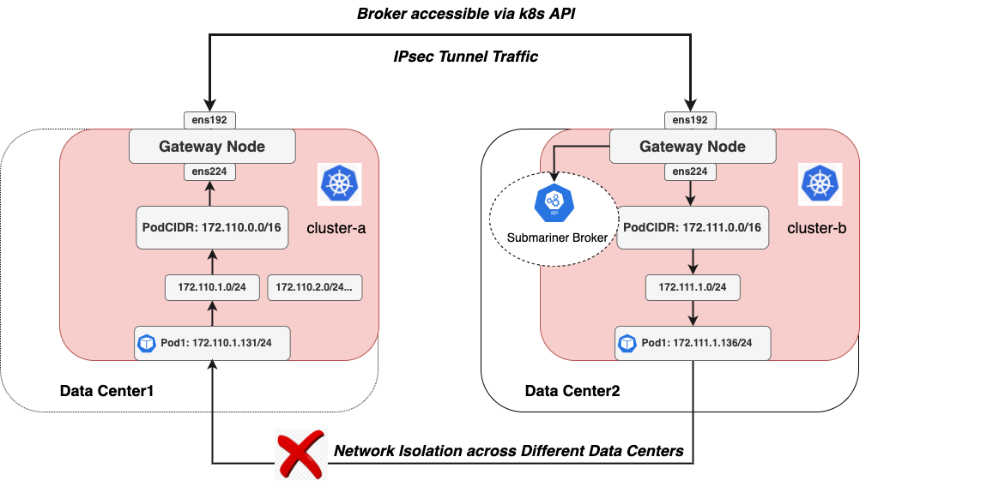

# 基于 Submariner 的多集群网络方案

[**English**](./submariner.md) | **简体中文**

## 背景

Spiderpool 为什么需要多集群网络联通方案？如果我们的不同集群分布在同一个数据中心，那它们之间的网络是天然联通的。但如果它们分布在不同的数据中心，集群子网是相互隔离，不能直接跨数据中心联通。所以 Spiderpool 需要一个多集群的网络联通方案，来解决跨数据中心的多集群网络访问问题。

[Submariner](https://github.com/submariner-io/submariner) 是一个开源的多集群网络联通方案，它借助隧道技术打通不同 Kubernetes 集群(运行在本地或者公有云)之间 Pod 与 Service 的直接通信。更多信息请参考 [Submariner Document](https://submariner.io/). 我们可以借助 Submariner 来帮助 Spiderpool 解决跨数据中心的多集群网络访问问题。

下面我们将详细介绍这个功能。

## 前置条件

* 至少两套未安装 CNI 的 Kubernetes 集群
* 安装 [Helm](https://helm.sh/docs/intro/install/)、[Subctl](https://submariner.io/operations/deployment/subctl/) 工具

## 场景介绍

下面是本次实验的网络拓扑图:



这个网络拓扑图介绍了以下信息:

* 集群 ClusterA 和 ClusterB 分布在不同的数据中心，它们的集群 Underlay 子网(172.110.0.0/16 和 172.111.0.0/16) 因为在不同数据中心网络隔离，不能直接通信。网关节点可以通过 ens192 网卡(10.6.0.0/16) 互相联通。

* 两套集群通过 Submariner 建立的 IPSec 隧道连接起来，隧道基于 网关节点的 ens192 网卡建立，并且也通过 ens192 网卡访问 Submariner 的 Broker 组件。

## 快速开始

### 安装 Spiderpool

1. 可参考 [安装](./readme-zh_CN.md) 安装 Spiderpool.

2. 配置 IP 池

    因为 Submariner 暂不支持多个子网，可以将集群的 PodCIDR 拆分为多个小的子网，指定 MacVlan Pod 分别从各自小子网中获取 IP 进行 Underrlay 通讯。注意: 需要保证与接入的 Underlay 子网对应。

    集群 cluster-a 的 PodCIDR 为: 172.110.0.0/16, 从这个大子网中创建多个小子网(172.110.1.0/24)供 Pod 使用:

    ```shell
    ~# cat <<EOF | kubectl apply -f -
    apiVersion: spiderpool.spidernet.io/v2beta1
    kind: SpiderIPPool
    metadata:
      name: cluster-a
    spec:
      default: true
      ips:
      - "172.110.1.1-172.110.1.200"
      subnet: 172.110.1.0/24
      gateway: 172.110.0.1
    EOF
    ```

    集群 cluster-b 的 PodCIDR 为: 172.111.0.0/16, 从这个大子网中创建小子网(172.111.1.0/24)供 Pod 使用:

    ```shell
    ~# cat <<EOF | kubectl apply -f -
    apiVersion: spiderpool.spidernet.io/v2beta1
    kind: SpiderIPPool
    metadata:
      name: cluster-b
    spec:
      default: true
      ips:
      - "172.111.1.1-172.111.1.200"
      subnet: 172.111.0.0/24
      gateway: 172.111.0.1
    EOF
    ```

3. 配置 SpiderMultusConfig 实例。

    在集群 cluster-a 上配置:

    ```shell
    ~# cat <<EOF | kubectl apply -f -
    apiVersion: spiderpool.spidernet.io/v2beta1
    kind: SpiderMultusConfig
    metadata:
      name: macvlan-conf
      namespace: kube-system
    spec:
      cniType: macvlan
      macvlan:
        master:
        - ens224
        ippools:
          ipv4:
          - cluster-a
      coordinator:
        hijackCIDR:
        - 10.243.0.0/18
        - 172.111.0.0/16
    EOF
    ```

    在集群 cluster-b 上配置:

    ```shell
    ~# cat <<EOF | kubectl apply -f -
    apiVersion: spiderpool.spidernet.io/v2beta1
    kind: SpiderMultusConfig
    metadata:
      name: macvlan-conf
      namespace: kube-system
    spec:
      cniType: macvlan
      macvlan:
        master:
        - ens224
        ippools:
          ipv4:
          - cluster-b
      coordinator:
        hijackCIDR:
        - 10.233.0.0/18
        - 172.110.0.0/16
    EOF
    ```

    > * 需要配置主机接口 ens224 作为 Macvlan 父接口，Macvlan 将以该网卡创建子接口给 Pod 使用。
    > * 需要配置 coordinator.hijackCIDR , 配置对端集群的 Service 和 Pod 的子网信息。启动 Pod 时，coordinator 将会在 Pod 中插入这些子网的路由，使访问这些目标时从节点转发。从而更好的与 Subamriner 协同工作。

### 安装 Submariner

通过 Subctl 工具安装 Submariner, 可参考 [Submariner官方文档](https://submariner.io/operations/deployment/)。 但注意执行 `subctl join` 的时候，需要手动指定上个步骤中提到的 MacVlan Underlay Pod 的子网。

```shell
# clusterA
subctl join --kubeconfig cluster-a.config broker-info.subm --clusterid=cluster-a --clustercidr=172.110.0.0/16
# clusterB
subctl join --kubeconfig cluster-b.config broker-info.subm --clusterid=cluster-b --clustercidr=172.111.0.0/16
```

> 目前 Submariner 只支持指定单个 Pod 子网，不支持多个子网

安装完成后，检查 submariner 组件运行状态:

```shell
[root@controller-node-1 ~]# subctl show all
Cluster "cluster.local"
 ✓ Detecting broker(s)
NAMESPACE               NAME                COMPONENTS                        GLOBALNET   GLOBALNET CIDR   DEFAULT GLOBALNET SIZE   DEFAULT DOMAINS   
submariner-k8s-broker   submariner-broker   service-discovery, connectivity   no          242.0.0.0/8      65536                                      

 ✓ Showing Connections
GATEWAY             CLUSTER     REMOTE IP     NAT   CABLE DRIVER   SUBNETS                         STATUS      RTT avg.     
controller-node-1   cluster-b   10.6.168.74   no    libreswan      10.243.0.0/18, 172.111.0.0/16   connected   661.938µs    

 ✓ Showing Endpoints
CLUSTER     ENDPOINT IP   PUBLIC IP         CABLE DRIVER   TYPE     
cluster01   10.6.168.73   140.207.201.152   libreswan      local    
cluster02   10.6.168.74   140.207.201.152   libreswan      remote   

 ✓ Showing Gateways
NODE                HA STATUS   SUMMARY                               
controller-node-1   active      All connections (1) are established   

 ✓ Showing Network details
    Discovered network details via Submariner:
        Network plugin:  ""
        Service CIDRs:   [10.233.0.0/18]
        Cluster CIDRs:   [172.110.0.0/16]

 ✓ Showing versions 
COMPONENT                       REPOSITORY           CONFIGURED   RUNNING                     
submariner-gateway              quay.io/submariner   0.16.0       release-0.16-d1b6c9e194f8   
submariner-routeagent           quay.io/submariner   0.16.0       release-0.16-d1b6c9e194f8   
submariner-metrics-proxy        quay.io/submariner   0.16.0       release-0.16-d48224e08e06   
submariner-operator             quay.io/submariner   0.16.0       release-0.16-0807883713b0   
submariner-lighthouse-agent     quay.io/submariner   0.16.0       release-0.16-6f1d3f22e806   
submariner-lighthouse-coredns   quay.io/submariner   0.16.0       release-0.16-6f1d3f22e806   
```

如上展示: submariner 组件正常，并且隧道成功建立。

如果遇到隧道不能成功建立，并且 submariner-gateway pod 一直处于 `CrashLoopBackOff` 状态。可能的原因有以下:

> * 请选择合适的节点作为网关节点，确保它们能够互相联通，否则隧道将无法建立
> * 如果 Pod 日志输出: "Error creating local endpoint object error="error getting CNI Interface IP address: unable to find CNI Interface on the host which has IP from [\"172.100.0.0/16\"].Please disable the health check if your CNI does not expose a pod IP on the nodes". 请检查网关节点是否配置 "172.100.0.0/16" 网段的地址，如果没有请配置。或者执行 `subctl join` 的时候关闭网关的健康检测功能: `subctl join --health-check=false ...`

## 创建应用

1. 使用以下的命令分别在集群 cluster-a 和 cluster-b 创建测试的 Pod 和 Service:

    ```shell
    cat <<EOF | kubectl create -f -
    apiVersion: apps/v1
    kind: Deployment
    metadata:
      name: test-app
    spec:
      replicas: 2
      selector:
        matchLabels:
          app: test-app
      template:
        metadata:
          annotations:
            v1.multus-cni.io/default-network: kube-system/macvlan-confg
          labels:
            app: test-app
        spec:
          containers:
          - name: test-app
            image: nginx
            imagePullPolicy: IfNotPresent
            ports:
            - name: http
              containerPort: 80
              protocol: TCP
    ---
    apiVersion: v1
    kind: Service
    metadata:
      name: test-app-svc
      labels:
        app: test-app
    spec:
      type: ClusterIP
      ports:
        - port: 80
          protocol: TCP
          targetPort: 80
      selector:
        app: test-app 
    EOF
    ```

2. 查看 Pod 的运行状态:

    在集群 Cluster-a 上查看:

      ```shell
      [root@controller-node-1 ~]# kubectl  get po -o wide
      NAME                        READY   STATUS    RESTARTS   AGE     IP                NODE                NOMINATED NODE   READINESS GATES
      test-app-696bf7cf7d-bkstk   1/1     Running   0          20m     172.110.1.131   controller-node-1   <none>           <none>

      [root@controller-node-1 ~]# kubectl get svc
      NAME           TYPE        CLUSTER-IP     EXTERNAL-IP   PORT(S)   AGE
      test-app-svc   ClusterIP   10.233.62.51   <none>        80/TCP    20m
      ```

    在集群 Cluster-b 上查看:

      ```shell
      [root@controller-node-1 ~]# kubectl  get po -o wide
      NAME                       READY   STATUS    RESTARTS   AGE     IP                NODE                NOMINATED NODE   READINESS GATES
      test-app-8f5cdd468-5zr8n   1/1     Running   0          21m     172.111.1.136   controller-node-1   <none>           <none>

      [root@controller-node-1 ~]# kubectl  get svc
      NAME           TYPE        CLUSTER-IP     EXTERNAL-IP   PORT(S)   AGE
      test-app-svc   ClusterIP   10.243.2.135   <none>        80/TCP    21m
      ```

3. 测试 Pod 跨集群通信情况:

    先进入到 Pod 内部，查看路由信息，确保访问对端 Pod 和 Service 时，经过主机的网络协议栈转发:

    ```shell
    # 在集群 Cluster-a 执行:
    [root@controller-node-1 ~]# kubectl exec -it test-app-696bf7cf7d-bkstk -- ip route

    10.7.168.73 dev veth0  src 172.110.168.131 
    10.233.0.0/18 via 10.7.168.73 dev veth0  src 172.110.168.131 
    10.233.64.0/18 via 10.7.168.73 dev veth0  src 172.110.168.131 
    10.233.74.89 dev veth0  src 172.110.168.131 
    10.243.0.0/18 via 10.7.168.73 dev veth0  src 172.110.168.131 
    172.110.1.0/24 dev eth0  src 172.110.168.131 
    172.110.168.73 dev veth0  src 172.110.168.131 
    172.111.0.0/16 via 10.7.168.73 dev veth0  src 172.110.168.131 
    ```

    从路由信息确认 10.243.0.0/18 和 172.111.0.0/16 从 veth0 转发。

    测试集群 Cluster-a 的 Pod 访问对端集群 Cluster-b 的 Pod :

    ```shell
    [root@controller-node-1 ~]# kubectl exec -it test-app-696bf7cf7d-bkstk -- ping -c2 172.111.168.136
    PING 172.111.168.136 (172.111.168.136): 56 data bytes
    64 bytes from 172.111.168.136: seq=0 ttl=62 time=0.900 ms
    64 bytes from 172.111.168.136: seq=1 ttl=62 time=0.796 ms

    --- 172.111.168.136 ping statistics ---
    2 packets transmitted, 2 packets received, 0% packet loss
    round-trip min/avg/max = 0.796/0.848/0.900 ms
    ```

    测试集群 Cluster-a 的 Pod 访问对端集群 Cluster-b 的 Service:

    ```shell
    [root@controller-node-1 ~]# kubectl exec -it test-app-696bf7cf7d-bkstk -- curl -I 10.243.2.135

    HTTP/1.1 200 OK
    Server: nginx/1.23.1
    Date: Fri, 08 Dec 2023 03:32:04 GMT
    Content-Type: text/html
    Content-Length: 4055
    Last-Modified: Fri, 08 Dec 2023 03:32:04 GMT
    Connection: keep-alive
    ETag: "632d1faa-fd7"
    Accept-Ranges: bytes
    ```

## 总结

Spiderpool 可在 Submariner 的帮助下，解决不同数据中心的多集群网络联通问题。
